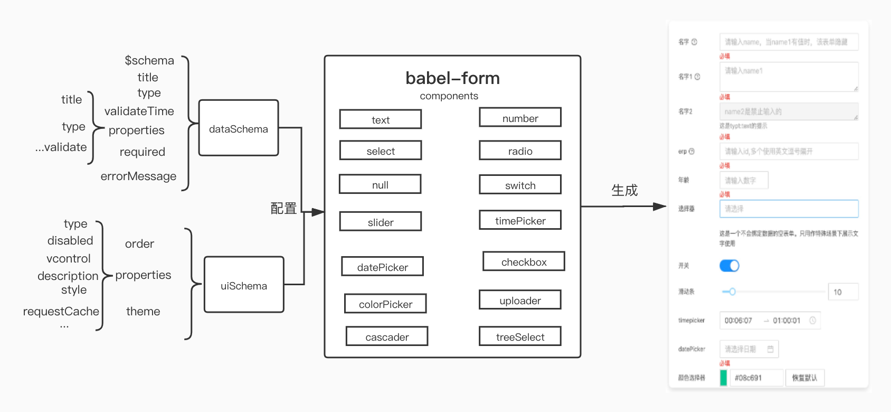
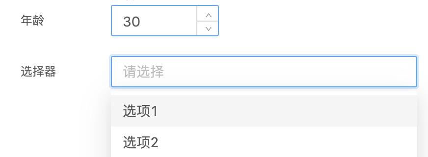
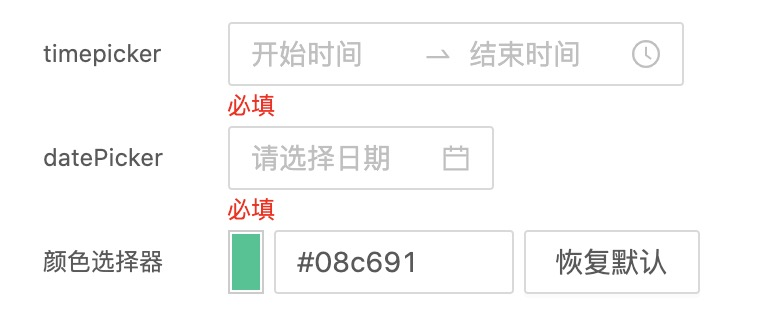
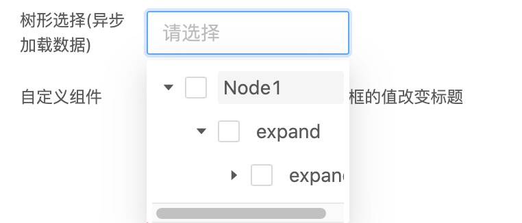

# drip-form

## 简介

drip-form 是一个自动表单渲染平台，支持以 JSON Schema 数据结构数据自动渲染表单内容。用一个方案去解决表单的复杂性、联动性、多样性、可配置、性能、ui 框架自由。

## 本项目能帮助你解决如下问题

1. 只需提供 JSON Schema 数据结构数据即可自动渲染出所需要的表单
2. 多表单联动
3. 可配置表单顺序、兜底文案、错误类型等
4. UI 框架自由，可选择两种主题(antd - 已支持、babel-ui-待支持)
5. 提升性能，避免一次改动渲染整个表单
6. 当表单过于复杂时，可为特定商家做到精简版

## 环境

**node >=13.14.0**

**yarn >=1.0.0**

## 安装

`jnpm install @jdfed/drip-form`

#### 主题安装

`jnpm install @jdfed/drip-form-theme-antd`

## 引入

```
import BabelForm from '@jdfed/drip-form'
import antd from '@jdfed/drip-form-theme-antd'
import '@jdfed/drip-form/dist/drip-form.min.css'
import '@jdfed/drip-form-theme-antd/dist/drip-form-theme-antd.min.css'
```

## drip-form 渲染流程



## 参数说明

### Json-Schema 参数参数配置说明

#### dataSchema

dataSchema 为 drip-form 表单定义组件唯一 Key，提供校验等功能。

### 参数说明

如需渲染最基本的表单，dataSchema 必须配置项为`$schema`、`properties`。`$schema`赋予校验当前 JSON 能力，我们在`properties`中定义表单组件。

| 属性         | 说明                                                        | 类型                                       | 是否为必须项 |
| ------------ | ----------------------------------------------------------- | ------------------------------------------ | ------------ |
| \$schema     | 指定当前校验用的 json-schema 协议规范。目前支持到`draft-07` | `string`                                   | `true`       |
| title        | 表单标题                                                    | `string`                                   | `false`      |
| type         | 表单的数据结构                                              | `object、array`                            | `false`      |
| validateTime | 执行校验的时间                                              | `change`(数据变化时)、`submit`(表单提交时) | `false`      |
| properties   | 表单子项配置                                                | `object`                                   | `true`       |
| required     | 表单中必填项配置，表单子项 key 值构成的数组                 | `array`                                    | `false`      |
| errorMessage | 错误提示配置                                                | `object`                                   | `false`      |

一个简单的配置示例，这里我们定义两个组件的唯一 Key 值`radio1`、`select1`，`title`是该组件名称，`type`是该组件数据类型，`default`给组件设置默认值。

```json
{
	"$schema": "http://json-schema.org/draft-07/schema#",
	"properties": {
		"radio1": {
			"title": "单选框",
			"type": "boolean",
			"default": true
		},
		"select1": {
			"title": "选择器",
			"type": ["string", "number", "array"]
		}
	}
}
```

### properties 表单子项配置

`properties`是 dataSchema 必填项，这里我们详细说明下。

| 属性           | 说明                                                                                                                                                                              | 类型                                   |
| -------------- | --------------------------------------------------------------------------------------------------------------------------------------------------------------------------------- | :------------------------------------- |
| title          | 组件名称，用于渲染 label                                                                                                                                                          | `string`                               |
| type           | 组件中使用的数据类型                                                                                                                                                              | `string`、`number`、`array`、`boolean` |
| default        | 组件默认值                                                                                                                                                                        | \*                                     |
| customFormat   | 自定义校验规则 date-time、color                                                                                                                                                   | `string`                               |
| rangeDelimiter | 限制范围                                                                                                                                                                          | `object`                               |
| \*             | 根据类型配置可选的校验规则，基于[ajv-validation](https://www.npmjs.com/package/ajv#validation-keywords)、[ajv-keywords](https://github.com/ajv-validator/ajv-keywords#keywords)； |                                        |

`properties`中定义组件唯一 key 值，名称可以自定义。

这里定义了`name2`、`erp`、`number1`、`colorPicker`，并且在`erp`和`number1`中定义了 drip-form 提供的校验规则`rangeDelimiter`、以及 ajv 中的校验参数。

### customFormat （drip-form 提供的校验规则）

customFormmat 提供`date-time`和`color`校验

示例

```json
{
	"$schema": "http://json-schema.org/draft-07/schema#",
	"properties": {
		"datePicker": {
			"title": "datePicker",
			"type": "string",
			"customFormat": "date-time"
		},
		"colorpicker": {
			"type": "string",
			"title": "颜色选择器",
			"default": "#08c691",
			"customFormat": "color"
		}
	}
}
```

### rangeDelimiter（限制范围）

对组件中的 string 类型进行校验，用分隔符校验长度。如校验输入的 ERP 账号。

| 参数      | 说明                          | 类型     | 是否为必传 |
| --------- | ----------------------------- | -------- | ---------- |
| delimiter | 定义分隔符，如逗号`,` 分号`;` | `string` | `true`     |
| max       | 最大长度                      | `number` | `true`     |
| min       | 最小长度                      | `number` | `true`     |

示例

```json
{
	"$schema": "http://json-schema.org/draft-07/schema#",
	"properties": {
		"erp": {
			"title": "erp",
			"type": "string",
			"rangeDelimiter": {
				"delimiter": ",",
				"max": 2,
				"min": 0
			}
		}
	}
}
```

### required 规定表单中必填项

如果需要在表单中规定必填项，就可以在这里规定需要校验的表单中的组件，`required`中填入在`properties`中定义的 key 值。

```json
{
  "$schema": "http://json-schema.org/draft-07/schema#",
	"type": "object",
	"validateTime": "change",
  "properties": {
    "text1": {
      ....
    },
    "text2": {
      ....
    }
  },
  "required": [
    "text1",
    "text2"
  ],
  "errorMessage": {
    "required": {
      "text1": "必填",
      "text2": "必填"
    },
    "properties": {
			"text1": "...",
			"text2": "..."
		}
  }
}
```

### errorMessage 配置

错误信息配置是用来做表单校验提示，当表单中组件校验错误会在组件下方提示错误信息

| 属性       | 说明                                        | 类型     |
| :--------- | :------------------------------------------ | :------- |
| required   | 必填项校验的报错信息，根据 key 值生成       | `object` |
| properties | 表单子项配置校验的报错信息，根据 key 值生成 | `object` |

drip-form 提供校验（目前支持`data-time`，`color`，`rangeDelimiter`）

示例

```JSON
{
  "$schema": "http://json-schema.org/draft-07/schema#",
	"type": "object",
	"validateTime": "change",
  "properties": {
    "datePicker": {
			"title": "datePicker",
			"type": "string",
			"customFormat": "date-time"
		},
    "colorpicker": {
			"type": "string",
			"title": "颜色选择器",
			"default": "#08c691",
			"customFormat": "color"
		},
    "erp": {
			"title": "erp",
			"type": "string",
			"rangeDelimiter": {
				"delimiter": ",",
				"max": 2,
				"min": 0
			}
    }
	},
	"required": [
		"timepicker",
		"datePicker",
		"erp"
	],
	"errorMessage": {
		"required": {
			"datePicker": "必填",
			"colorpicker": "必填",
			"erp": "必填",
		},
		"properties": {
			"timepicker": "时间格式错误",
			"datePicker": "时间格式错误",
			"erp": "最多10个",
		}
	}
}
```

#### 2.uiSchema (表单中各个组件类型及组件参数数据) **必传**

- `order`表单项顺序，默认按照 dataSchema 生成，只有在 order 里面的字段才会被渲染
- `theme`是可选 UI 使用主题，现已支持 antd 组件主题
- `properties`中配置表单中组件的类型及组件参数数据，`type`表示使用什么组件

```
{
    "order": ["formItem1"],
    "theme": "antd",
    "properties": {
        ...
    }
}
```

| 属性       | 说明                                                                    | 类型     | 默认值 |
| :--------- | :---------------------------------------------------------------------- | :------- | :----- |
| order      | 表单项顺序，默认按照 dataSchema 生成。只有在 order 里面的字段才会被渲染 | `array`  | -      |
| theme      | 框架主题                                                                | `antd`   | `antd` |
| properties | 表单子项配置                                                            | `object` | -      |

### properties 表单子项配置

| 属性         | 说明                                                                 | 类型                                 |
| :----------- | :------------------------------------------------------------------- | :----------------------------------- |
| type         | 表单项类型                                                           | `text`                               |
| disabled     | 是否禁用                                                             | `boolean`                            |
| vcontrol     | 控制表单联动展示隐藏部分                                             | `string`                             |
| description  | 表单提示                                                             | `object`                             |
| style        | 表单样式                                                             | `object`                             |
| requestCache | 是否每次都调接口查询表单数据。需要配合 babelForm 的 onQuery 字段使用 | `boolean` 目前 select、cascader 支持 |
| \*           | 根据类型配置可选的 UI 补充项                                         | \*                                   |

```json
{
	"order": ["babelRadio", "babelSelect"],
	"theme": "antd",
	"properties": {
		"babelRadio": {
			"type": "radio",
			"theme": "babel-ui",
			"options": [
				{ "label": "北京", "value": "0" },
				{ "label": "上海", "value": "1" },
				{ "label": "成都", "value": "2" },
				{ "label": "武汉", "value": "3" }
			]
		},
		"babelSelect": {
			"type": "select",
			"theme": "babel-ui",
			"options": [
				{ "label": "苹果", "value": "1", "disabled": false },
				{ "label": "橘子", "value": "2", "disabled": true },
				{ "label": "桃子", "value": "3", "disabled": false },
				{ "label": "香蕉", "value": "4", "disabled": false }
			]
		}
	}
}
```

### 说明

properties 中定义的是组件渲染项，通过 dataSchema 中定义的组件唯一 key 值进行渲染如下图对应关系

```json
{
	"$schema": "http://json-schema.org/draft-07/schema#",
	"properties": {
		"babelRadio": {
			"title": "单选框",
			"type": "string",
			"default": "0"
		},
		"babelSelect": {
			"title": "选择器",
			"type": ["string", "number", "array"],
			"default": []
		}
	}
}
```

### properties 参数

| 属性         | 说明                                                                        | 类型                                 |
| ------------ | :-------------------------------------------------------------------------- | :----------------------------------- |
| type         | 表单项类型                                                                  | `text`                               |
| disabled     | 是否禁用                                                                    | `boolean`                            |
| vcontrol     | 控制表单联动展示隐藏部分                                                    | `string`                             |
| description  | 表单提示                                                                    | `object`                             |
| style        | 表单样式                                                                    | `object`                             |
| requestCache | 是否每次都调接口查询表单数据。需要配合 babelForm 的 onQuery 字段使用        | `boolean` 目前 select、cascader 支持 |
| \*           | 根据类型配置可选的 UI 补充项，根据 babel-ui 组件参数来定义 drip-form 中组件 | \*                                   |

## vcontrol

可以用来控制表单中其他组件的显隐

`"vcontrol": "return formData.switch1"`

`formData`是关键字

在需要被控制的组件中写入`vcontrol`，如使用`switch`组件对自定义组件`custom1`的显示隐藏进行控制。

🌰

dataSchema

```json
{
	"$schema": "http://json-schema.org/draft-07/schema#",
	"type": "object",
	"validateTime": "change",
	"properties": {
		"switch1": {
			"title": "开关",
			"type": "boolean"
		},
		"custom1": {
			"title": "自定义组件"
		}
	},
	"required": [],
	"errorMessage": {
		"required": {},
		"properties": {}
	}
}
```

uiSchema

```Json
{
  "order": ["switch1","custom1"],
  "theme": "babel-ui",
  "properties": {
    "switch1": {
			"type": "switch"
    },
    "custom1": {
			"type": "custom",
			"vcontrol": "return formData.switch1"
    }
  }
}
```

component

```jsx
import React, { Component, memo, useState } from 'react'
import BabelForm from '@jdfed/drip-form'
import BabelUI from '@jdfed/drip-form-theme-babelUI'
import BabelUIComponent from '@jdfed/babel-ui'
import dataSchema from './dataSchema.json'
import uiSchema from './uiSchema.json'

import '@jdfed/drip-form/dist/drip-form.min.css'

const { Button } = BabelUIComponent

const CustomField1 = memo(() => {
	const [count, setCount] = useState(0)
	return (
		<div>
			<p>You clicked {count} times</p>
			<Button onClick={() => setCount(count + 1)}>Click me</Button>
		</div>
	)
})

const customComponents = {
	custom1: CustomField1,
}

export default class Form extends Component {
	render() {
		return (
			<div>
				<BabelForm
					dataSchema={dataSchema}
					uiSchema={uiSchema}
					uiComponents={{
						'babel-ui': BabelUI,
					}}
					customComponents={customComponents}
				/>
			</div>
		)
	}
}
```

### uiComponents

选择的主题包，如选用 antd 主题

```
import antd from '@jdfed/drip-form-theme-antd'
import '@jdfed/drip-form-theme-antd/dist/drip-form-theme-antd.min.css'

```

### control

做表单联动操作，对表单的 UI 进行渲染  
如操作 Radio 组件

```
control = {({ dispatch, formData }) => {
          dispatch({
            type: 'setDataSchema',
            'properties.custom.title': formData.radio === '0' ? '0' : '1',
          })
        }}
```

### onQuery

对于数据量较大的数据，可采用异步获取数据。

```
onQuery={treeSelect: async ({ isFirstLoad, pId }) => {
        //这里做些异步获取数据操作
        console.log('treeselect异步查询数据')
      }}
```

### customComponents

自定义组件

```
const customComments = () => return <div>自定义组件</div>
```

### 表单数据获取

**通过 ref.current 获取到表单的错误（errors）和表单的数据(formData)**

```
const ref = useRef()
const onSubmit = () => {
  console.log(ref.current)
}
<BabelForm
    ref={ref}
    dataSchema={dataSchema}
    uiSchema={uiSchema}
/>
<Button
  type="primary"
  className="button--submit"
  onClick={() => {
    onSubmit()
  }}
>
  提交表单
</Button>
```

## 使用

#### 示例 1

```
import BabelForm from '@jdfed/drip-form'
import antd from '@jdfed/drip-form-theme-antd'
import '@jdfed/drip-form-theme-antd/dist/drip-form-theme-antd.min.css'
import '@jdfed/drip-form/dist/drip-form.min.css'

const dataSchema = {
  "$schema": "http://json-schema.org/draft-07/schema#",
	"type": "object",
	"validateTime": "change",
    "properties": {
      "number1": {
        "title": "年龄",
        "type": "number",
        "minimum": 0,
        "maximum": 100,
        "multipleOf": 3
		},
      "select1": {
        "title": "选择器",
        "type": ["string", "number", "array"],
        "default": []
        }
  }
}

const uiSchema = {
  "order": ["number1", "select1"],
      "theme": "antd",
      "properties": {
        "number1": {
			"type": "number",
			"placeholder": "请输入数字",
			"step": 10,
			"min": 0,
			"max": 100,
			"style": {
				"width": 110
			}
		},
		"select1": {
			"type": "select",
			"placeholder": "请选择",
			"allowClear": true,
			"multiple": true,
			"style": {
				"width": "100%"
			},
			"requestCache": true
		  }
  }
}

const Demo = () => (
  <>
    <BabelForm
      uiSchema={uiSchema}
      dataSchema={dataSchema}
      uiComponents={{ antd }}
    />
  </>
)

```

#### 上述配置后渲染的实例



## 组件支持主题

- 持续更新

| 组件名                 | antd 主题 | babel-ui 主题 |
| ---------------------- | :-------: | ------------: |
| text 文本输入          |  已支持   |        已支持 |
| number 数字输入        |  已支持   |        已支持 |
| select 选择器          |  已支持   |        已支持 |
| radio 单选框           |  已支持   |        已支持 |
| null 空表单            |  已支持   |        已支持 |
| switch 开关            |  已支持   |        已支持 |
| slider 滑动输入条      |  已支持   |        待支持 |
| timePicker 时间选择器  |  已支持   |        已支持 |
| datePicker 日期选择器  |  已支持   |        待支持 |
| colorPicker 颜色选择器 |  已支持   |        已支持 |
| checkbox 多选框        |  已支持   |        已支持 |
| uploader 上传          |  已支持   |        待支持 |
| cascader 级联选择      |  已支持   |        已支持 |
| treeSelect 树形选择器  |  已支持   |        待支持 |

## drip-form API

| 参数             |      类型      | 是否为必传 | 描述                                         |
| ---------------- | :------------: | :--------: | :------------------------------------------- |
| dataSchema       |    `object`    |    true    | 表单中组件类型配置项                         |
| uiSchema         |    `object`    |    true    | 表单中各组件配置内容数据                     |
| uiComponents     |    `object`    |    true    | 主题（现支持 ant）                           |
| customComponents | `{custom: {}}` |   false    | 自定义组件                                   |
| control          |   `function`   |   false    | 表单联动，将当前表单数据传递到另外一个表单中 |
| onQuery          |    `object`    |   false    | 异步获取表单组件中的数据                     |

## 示例 2

```
import BabelForm from '@jdfed/drip-form'
import antd from '@jdfed/drip-form-theme-antd'
mport '@jdfed/drip-form-theme-antd/dist/drip-form-theme-antd.min.css'
import '@jdfed/drip-form/dist/drip-form.min.css'

//表单中组件类型配置项
const uiSchema = {
  "order": [
    "timepicker",
    "datePicker",
    "colorpicker",
  ],
  "theme": "antd",
  "properties": {
    "timepicker": {
		"type": "timePicker",
		"range": true
	},
	"datePicker": {
		"type": "datePicker"
	},
	"colorpicker": {
		"type": "colorPicker"
	},
  }
}

//表单中各组件配置内容数据
const dataSchema = {
  "$schema": "http://json-schema.org/draft-07/schema#",
  "type": "object",
  "validateTime": "change",
  "properties": {
    "timepicker": {
      "title": "timepicker",
      "type": "array",
      "items": [
        {
          "type": "string",
          "format": "time"
        },
        {
          "type": "string",
          "format": "time"
        }
      ]
    },
    "datePicker": {
      "title": "datePicker",
      "type": "string",
      "customFormat": "date-time"
    },
    "colorpicker": {
      "type": "string",
      "title": "颜色选择器",
      "default": "#08c691",
      "customFormat": "color"
    },
  },
  "required": [
    "timepicker",
    "datePicker",
    "colorpicker",
  ],
  "errorMessage": {
    "timepicker": "必填",
    "datePicker": "必填",
    "colorpicker": "必填",
  }
}


//自定义组件
const customComments = () => return <div>这是自定义组件,会随着单选框的值改变标题</div>

const App = () => {
  <>
    <BabelForm
      uiSchema={uiSchema}
      dataSchema={dataSchema}
      uiComponents={{uiComponents}}
      customComments={customComments}
      control={({ dispatch, formData }) => {
          dispatch({
            type: 'setDataSchema',
            'properties.custom.title': formData.radio === '0' ? '0' : '1',
          })
        }}
      onQuery={treeSelect: async ({ isFirstLoad, pId }) => {
        //这里做些异步获取数据操作
        console.log('treeselect异步查询数据')
      }}
    />
  </>
}

```

### 效果图




## 混合主题

`Babel-Form`支持多主题混合样式，用户只需要针对`uiSchema`做相关配置修改，同时引入需要的主题包即可：

- 修改`uiSchema`：

  ```javascript
  /* config.js */

  export const uiSchema = {
  	// 默认使用antd主题包
  	theme: 'antd',
  	// 其他配置项
  	properties: {
  		name: {
  			title: '名字',
  			// 针对该子项配置主题，使用babel-ui渲染
  			theme: 'babel-ui',
  			type: 'string',
  			maxLength: 5,
  			transform: ['trim'],
  		},
  	},
  }
  ```

- 引入主题包

  ```
  /* App.js */

  ...
  // 除antd外，导入babel-ui主题包
  import BabelUI from '@jdfed/drip-form-theme-babelUI'

  // 导入多个主题包
  <BabelForm
    ...
    uiComponents={{
        antd,
        'babel-ui': BabelUI
    }}
   />
  ```
